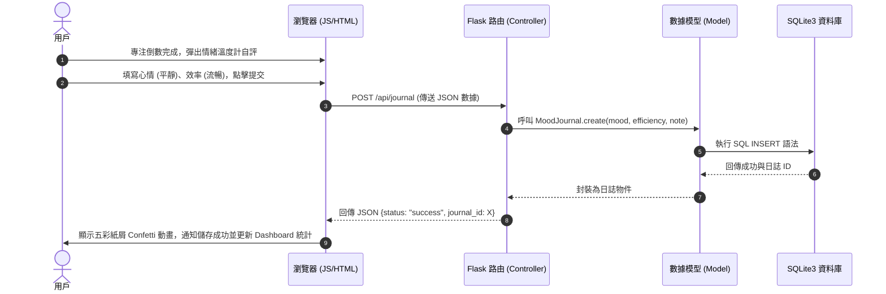

# 系統架構設計文件 (ARCHITECTURE) - ZenFocus

本文件根據 [PRD.md](file:///C:/Users/a1030/.gemini/antigravity/scratch/web_app_development/docs/PRD.md) 的需求，詳細規劃 **ZenFocus** 的技術選型、資料夾結構、元件關係以及關鍵的設計決策。

---

## 1. 技術架構說明

### 1.1 選用技術與原因
為了符合專案目標，本系統採用經典的單體 Web 架構 (Monolithic Architecture)，其技術棧選擇與考量如下：

*   **後端框架：Python + Flask**
    *   *選用原因*：Flask 是一款輕量級且高擴充性的微框架 (Micro-framework)，它沒有強制性的框架約束，能以最簡單的代碼搭建路由與 API 接口，非常適合做為中小型的 Web 實作。
*   **前端渲染：Jinja2 模板引擎**
    *   *選用原因*：Jinja2 是 Flask 內建的 HTML 模板引擎。它能讓我們直接在後端渲染動態資料（例如：加載當前任務清單、統計數據），無須在前期引入複雜的前端 SPA 框架（如 React/Vue），從而降低開發難度並提升頁面初次載入的速度。
*   **資料庫：SQLite (使用 Python `sqlite3` 庫)**
    *   *選用原因*：SQLite 是一個內嵌式的無伺服器 (Serverless) 輕量級關聯式資料庫。它將所有資料儲存在單一的 `.db` 檔案中，極易隨專案一起備份與部署，適合本次專注力歷史與任務數據的持久化。
*   **前端樣式與互動：HTML5 + Vanilla CSS3 + Vanilla JS**
    *   *選用原因*：為了實現極緻奢華的「毛玻璃美學 (Glassmorphism)」與霓虹漸變發光動畫，原生 CSS3 提供了最高的自定義控制權。原生 JavaScript 能零延遲操縱 Web Audio API 實現多軌白噪音混音與 SVG 番茄鐘倒數。

---

### 1.2 Flask MVC 模式說明
雖然 Flask 本身不強制約束架構，但本專案將主動遵循 **MVC (Model-View-Controller)** 模式來組織代碼，以利團隊分工：

```
                    ┌────────────────────────┐
                    │       Browser          │
                    └────┬──────────────▲────┘
                         │ 1. Request   │ 6. Response (HTML)
                         ▼              │
                  ┌──────────────┐      │
                  │  Controller  ├──────┘
                  │ (Flask Route)│
                  └──────┬───▲───┘
            2. Query Data│   │ 5. Render Template
                         ▼   │
     ┌──────────────┐     ┌──┴───────────┐
     │    Model     ├────►│     View     │
     │(SQLite Schema│     │(Jinja2 HTML) │
     └──────┬───▲───┘     └──────────────┘
 3. SQL cmd│   │ 4. Results
            ▼   │
     ┌──────────┴───┐
     │    SQLite    │
     └──────────────┘
```

1.  **Model (模型 - `app/models/`)**：
    *   *職責*：負責定義資料表結構（Schema）以及與資料庫的直接交互（增刪查改 SQL 語法）。
    *   *實作*：定義任務 (Task)、番茄紀錄 (FocusLog)、情緒日誌 (MoodJournal) 的資料結構。
2.  **View (視圖 - `app/templates/` & `app/static/`)**：
    *   *職責*：負責呈現視覺介面給用戶，接收 Controller 傳入的動態變數，並將其嵌入 HTML 中渲染。
    *   *實作*：主控面板模板 (`index.html`)、數據統計面板 (`dashboard.html`) 等，配合 CSS 提供毛玻璃樣式，JS 提供混音器與計時器動態邏輯。
3.  **Controller (控制器 - `app/routes/`)**：
    *   *職責*：負責處理使用者的 HTTP 請求 (Request)，協調 Model 獲取或更新數據，最後呼叫 View 渲染出 HTML，或返回 JSON 數據給前端 API。
    *   *實作*：頁面路由（如 `/`首頁、`/dashboard`）、API 路由（如 `/api/tasks`新增任務、`/api/journal`儲存情緒日誌）。

---

## 2. 專案資料夾結構

本專案採用高度模組化且職責明確的資料夾結構，以支援多人 Git 分工協作：

```
web_app_development/
│
├── app/                        # 應用程式主目錄
│   ├── __init__.py             # 初始化 Flask app，配置資料庫與註冊藍圖 (Blueprints)
│   │
│   ├── models/                 # Model 層：資料庫結構與資料存取方法
│   │   ├── __init__.py
│   │   ├── task.py             # 任務看板資料表 (tasks) 的 SQL 交互邏輯
│   │   ├── focus.py            # 番茄專注紀錄 (focus_logs) 的 SQL 交互邏輯
│   │   └── journal.py          # 心流日誌與情緒溫度計 (mood_journals) 的 SQL 交互邏輯
│   │
│   ├── routes/                 # Controller 層：處理請求與 API 路由
│   │   ├── __init__.py
│   │   ├── pages.py            # 首頁、統計頁面等網頁 HTML 渲染路由
│   │   ├── tasks_api.py        # 任務看板 RESTful API 路由 (JSON 互動)
│   │   ├── focus_api.py        # 番茄計時紀錄 API 路由
│   │   └── journal_api.py      # 情緒日誌 API 路由
│   │
│   ├── static/                 # 靜態資源 (由瀏覽器直接加載)
│   │   ├── css/
│   │   │   └── style.css       # 全域毛玻璃樣式、漸變背景、霓虹發光與微動畫 CSS
│   │   ├── js/
│   │   │   ├── main.js         # 前端總控：分頁切換、初始化
│   │   │   ├── timer.js        # 番茄鐘模組：SVG 進度環、倒數計時與粒子動畫
│   │   │   ├── mixer.js        # 混音器模組：Web Audio API 音訊開關與音量混合
│   │   │   └── dashboard.js    # 儀表板模組：前端圖表渲染、日誌時間軸動態渲染
│   │   └── audio/              # 白噪音無縫循環音頻資源 (MP3/OGG)
│   │       ├── rain.mp3
│   │       ├── bonfire.mp3
│   │       └── singing-bowl.mp3 # 磬聲結束提示音
│   │
│   └── templates/              # View 層：Jinja2 HTML 模板
│       ├── base.html           # 基礎骨架：包含全域頭尾、Google 字型與靜態資源引入
│       ├── index.html          # 主頁模板：番茄鐘、任務清單與混音器
│       └── dashboard.html      # 統計儀表板模板：數據統計與心流日誌時間軸
│
├── database/                   # 資料庫初始化腳本與結構設計
│   └── schema.sql              # 儲存完整的 SQLite 建表語法
│
├── docs/                       # 設計與開發階段的說明文件 (PRD、架構等)
│   ├── PRD.md
│   └── ARCHITECTURE.md
│
├── instance/                   # 存放本機資料庫實體 (Git 忽略，動態生成)
│   └── database.db             # 實際儲存數據的 SQLite 資料庫檔案
│
├── app.py                      # 應用程式入口檔案：運行並啟動 Flask Server
├── requirements.txt            # 專案依賴包清單 (如 Flask)
└── README.md                   # 專案總覽與說明
```

---

## 3. 元件關係與資料流圖 (Component Relationships)

### 3.1 專注倒數結束與日誌儲存資料流

下圖展示了當番茄鐘結束，用戶填寫心流日誌後，系統元件間的協作關係：



### 3.2 路由渲染資料流 (View Rendering)
當用戶訪問 `/dashboard` 統計頁面時的資料流向：
1.  **瀏覽器** 發送 `GET /dashboard` 請求。
2.  **Flask Route (`app/routes/pages.py`)** 攔截請求，並呼叫：
    *   `FocusLog.get_weekly_summary()` 獲取專注時間。
    *   `MoodJournal.get_all_logs()` 獲取歷史情緒日誌。
3.  **Model** 查詢 **SQLite** 資料庫並將結果以 Dict 結構返還。
4.  **Route** 將這些統計變數傳入 `render_template('dashboard.html', summary=summary, journals=journals)`。
5.  **Jinja2 模板引擎** 將數據動態填入網頁骨架，編譯成純 HTML5 回傳給 **瀏覽器**。
6.  **瀏覽器** 渲染出帶有漂亮圖表與時間軸的毛玻璃網頁。

---

## 4. 關鍵設計決策 (Key Design Decisions)

為確保專案兼具高視覺品質與極佳效能，並在小組開發中維持敏捷，我們做出了以下 4 個關鍵決策：

### 決策 1：後端渲染 (Jinja2) 與前端 RESTful API 混合架構
*   **決策說明**：一般網頁渲染由 Jinja2 在伺服器端完成（如加載首頁骨架與儀表板基本內容），但對於**高度動態交互**的功能（如任務看板的新增/刪除、計時紀錄的即時提交），我們採用前端 JavaScript 發送非同步請求 (Fetch API) 到 Flask JSON API。
*   **決策原因**：如果完全使用傳統網頁刷新 (Page Reload) 來更新待辦事項，會導致正在播放的白噪音音訊中斷、番茄鐘重置。混合架構能確保**音樂與計時在無刷新的情況下完美運行**，同時保有 SEO 與初次載入的效能優勢。

### 決策 2：無登入機制的 Session-based 或單一本地資料庫設計
*   **決策說明**：作為 MVP (最小可行性產品) 課堂專案，系統暫不實作繁瑣的帳號註冊與密碼加密。SQLite 資料庫在後端預設儲存於同一張表，並以 `session` ID (或是前端的臨時 ID) 作為簡易區隔。
*   **決策原因**：避免團隊深陷在 OAuth2 或使用者密碼驗證的安全泥淖中，能將 100% 的精力聚焦在前端極致的「毛玻璃動畫美學」與「白噪音混音體驗」上，確保專案能以最高品質按時交付。

### 決策 3：選用 HTML5 Web Audio API 來處理多軌環境音效
*   **決策說明**：不使用簡單的 `<audio>` 標籤，而是透過 JavaScript 的 `AudioContext` 與 `GainNode` 控制音訊。
*   **決策原因**：原生 `<audio>` 標籤在循環播放 (Loop) 時通常會產生微小的爆音或 0.5 秒的無聲停頓。Web Audio API 允許對多個音軌進行無縫混音、平滑淡入淡出 (Fade-in/Fade-out)，並且能單獨精確調節每軌的音量比例，保障最優質的沉浸式聽覺體驗。

### 決策 4：堅持手寫 Vanilla CSS 與微發光動畫，而非 TailwindCSS
*   **決策說明**：前端樣式完全手工撰寫 CSS，定義一套嚴謹的 CSS 變數（毛玻璃濾鏡、色彩漸變軌道、霓虹發光半徑等）。
*   **決策原因**：TailwindCSS 的毛玻璃樣式設定較為生硬，且大量的類名堆疊會降低 Jinja2 模板的可讀性。手寫 CSS 能夠利用 `backdrop-filter: blur(12px)`、`transition: background 1.5s ease` 等屬性，打造最具禪意、呼吸感十足的動態漸變主題背景。
