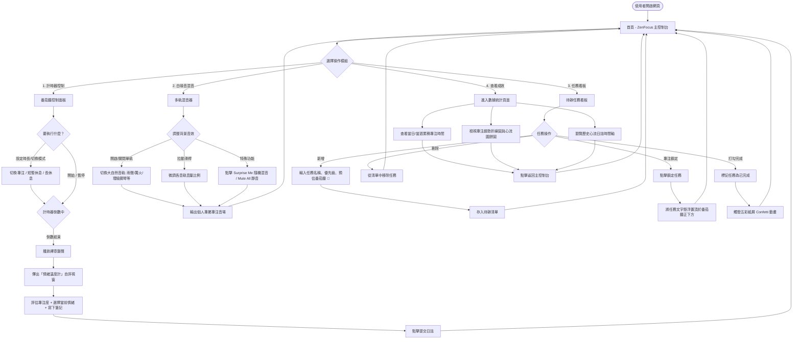
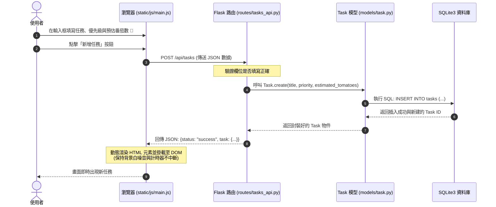
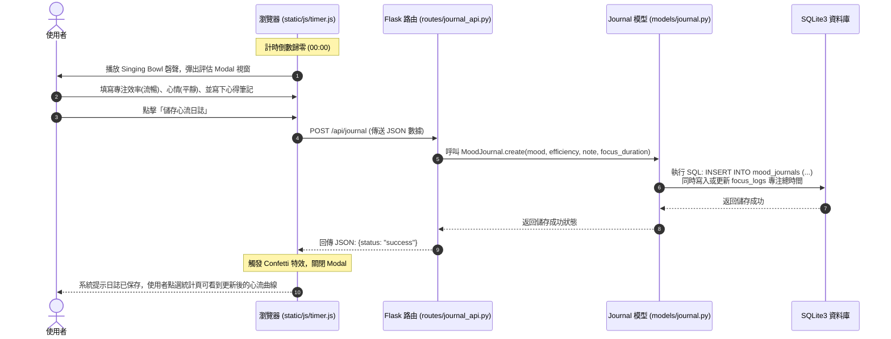

# 系統流程圖與路由對照文件 (FLOWCHART) - ZenFocus

本文件詳細規劃了 **ZenFocus** 的使用者操作流程 (User Flow)、系統內部交互序列圖 (Sequence Diagrams) 以及完整的功能與路由對照表。

---

## 1. 使用者流程圖 (User Flow)

使用者進入 ZenFocus 網頁後的完整操作路徑如下圖所示。系統分為三大主模組：**番茄鐘計時器**、**多軌白噪音混音器**、與**待辦任務看板**，並包含計時完成後的**心流日誌與數據統計**。

---

## 2. 系統序列圖 (Sequence Diagrams)

### 2.1 新增任務並渲染至看板
本序列圖描述使用者在前端新增待辦任務，系統將資料寫入 SQLite 資料庫並即時局部更新看板的流程：

---

### 2.2 番茄鐘結束、提交情緒日誌與更新統計
本序列圖描述番茄鐘結束後，使用者填寫專注評估心情，後端進行數據持久化，並即時更新統計看板的流程：

---

## 3. 功能與路由對照表 (Routing & Page Mapping)

ZenFocus 的所有頁面路由與 RESTful API 設計規劃如下：

### 3.1 網頁頁面路由 (Page Routes)
負責直接渲染 HTML 模板：

| 功能名稱 | URL 路徑 | HTTP 方法 | Jinja2 模板檔案 | 說明 |
| :--- | :--- | :--- | :--- | :--- |
| **首頁控制台** | `/` | `GET` | `index.html` | 系統主介面。加載番茄鐘計時器、多軌混音器與今日待辦任務清單。 |
| **數據統計儀表板** | `/dashboard` | `GET` | `dashboard.html` | 展示專注時間統計圖表、情緒比例分析與歷史心流日誌時間軸。 |

---

### 3.2 RESTful API 路由 (JSON API Routes)
負責處理前端 JavaScript 的非同步請求 (Fetch API)，不刷新網頁，以保證白噪音音軌播放的連續性：

| 模組分類 | API 端點 | HTTP 方法 | 請求參數 (JSON) | 響應結果 (JSON) | 說明 |
| :--- | :--- | :--- | :--- | :--- | :--- |
| **任務看板** | `/api/tasks` | `GET` | 無 | `[ { "id": 1, "title": "...", "priority": "high", "completed": false }, ... ]` | 獲取所有未完成與已完成的任務清單。 |
| | `/api/tasks` | `POST` | `{ "title": "寫作業", "priority": "high", "estimated_tomatoes": 3 }` | `{ "status": "success", "task": { "id": 12, ... } }` | 新增一項任務。 |
| | `/api/tasks/<int:id>/complete` | `POST` | 無 | `{ "status": "success" }` | 標記特定任務為已完成（打勾）。 |
| | `/api/tasks/<int:id>/lock` | `POST` | `{ "locked": true }` | `{ "status": "success" }` | 將特定任務鎖定置頂（懸浮於計時器下方）。 |
| | `/api/tasks/<int:id>` | `DELETE` | 無 | `{ "status": "success" }` | 刪除特定任務。 |
| **專注統計** | `/api/focus/log` | `POST` | `{ "duration": 1500, "mode": "focus" }` | `{ "status": "success", "log_id": 45 }` | 當番茄鐘完成時，向後端紀錄一筆專注/休息時間紀錄。 |
| **心流日誌** | `/api/journal` | `POST` | `{ "mood": "平靜", "efficiency": "極高", "note": "完成第3章開發！" }` | `{ "status": "success" }` | 儲存專注完成後的情緒日誌，寫入資料庫。 |
| | `/api/journal` | `GET` | 無 | `[ { "id": 1, "created_at": "...", "mood": "平靜", "note": "..." }, ... ]` | 獲取所有歷史情緒日誌，用於渲染統計頁的時間軸。 |
